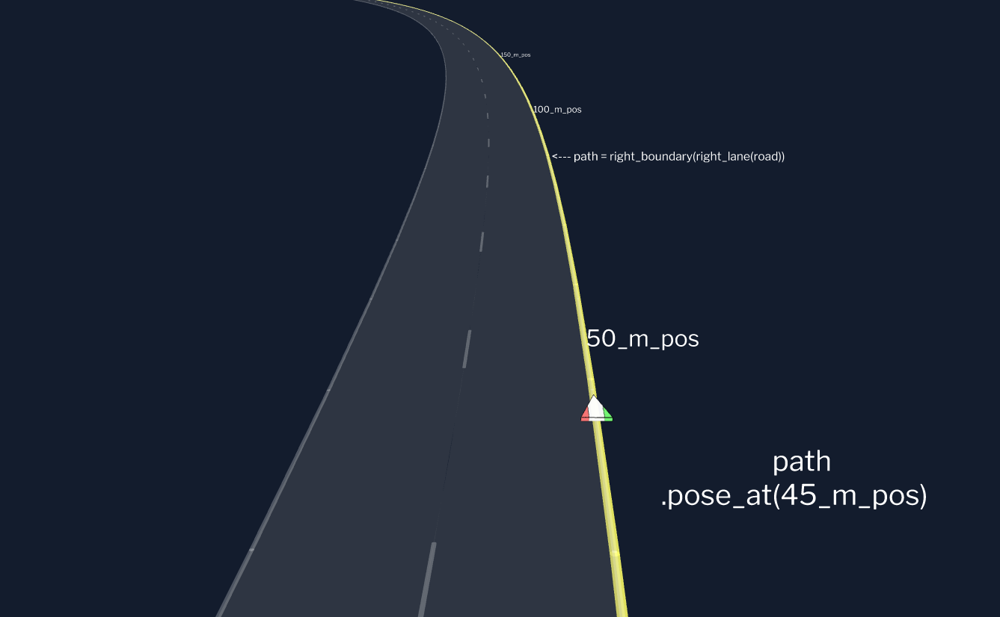
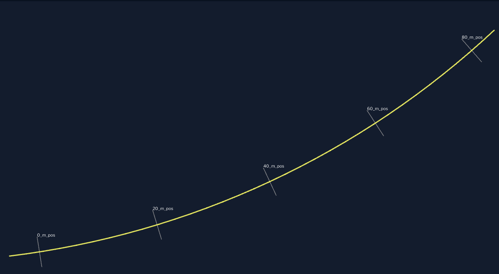
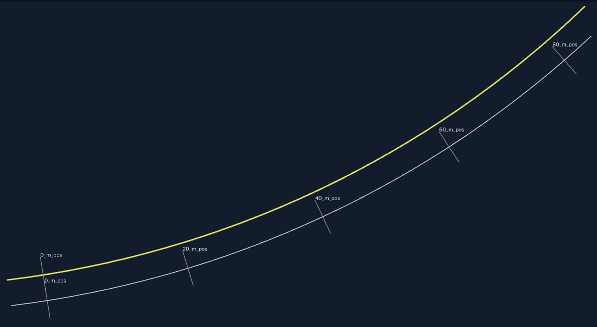
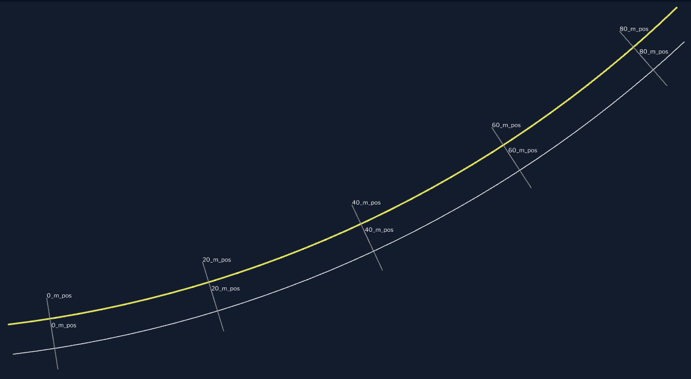
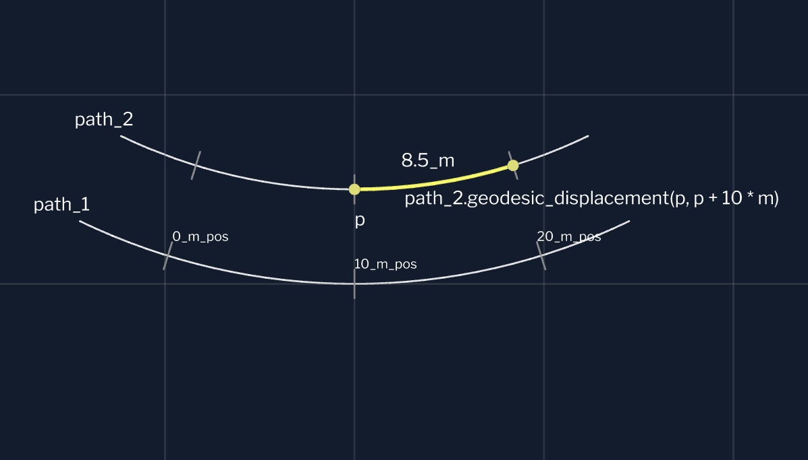

# (Title image placeholder)

Notes:

- Welcome!
- Two kinds of audience
  - People testing functions w/complicated inputs
    - Testing is hard
    - use concrete example where we made it easy
    - Mention generic principles at the end
  - Motion planning for self driving
    - Lucky!  Clear, specific paths through design space

---

## Aurora and Me

<div class="r-stack">

<div class="fragment" style="position: absolute; width: 100%; text-align: center;">

</div>
</div>

Notes:

- Aurora
  - benefits of self driving, safely, quickly, broadly
  - launching first product _this year_: self-driving trucks, Dallas to Houston
- Me: Chip Hogg
  - Almost 4 years at Aurora, on motion planning team, almost 9 in self driving
  - Main contribution: making good tests easy

- Disclaimer
  - May not be exactly what you would find if you went to Aurora today
    - Interfaces evolve
    - Changed some terms
    - Some features are incomplete
  - The point of the talk is to communicate design principles

---

# Tests

Notes:

- Let's talk about tests generally.

---

## Testing Pyramid


Notes:

- Tests: on a spectrum
  - Unit: fine-grained, fast, isolated
  - Integration: bring components together
  - End-to-end: entire system
    - Self driving e2e examples: sim, track, on-road
  - Compiler errors: maybe even faster than unit tests
- Higher up: bigger scope, slower, more expensive
- Lower: isolated, fast, cheap, easy to understand, tight iteration cycles
- We're here in the middle: from big unit tests to integration tests

---

## Arrange, Act, Assert

```cpp
TEST(Florpinate, ProducesGoodStuff) {
  //
  // ARRANGE
  //
  // Create the inputs you'll need
  //
  const auto a = make_input_one();
  const auto b = make_input_two();

  //
  // ACT
  //
  // Perform the action under test
  //
  const auto result = florpinate(a, b);

  //
  // ASSERT
  //
  // Check the properties of what you made
  //
  EXPECT_THAT(result.stuff(), IsGood());
}
```

Notes:

- Unit/integration tests: 3 phases
  - Arrange: set things up
  - Act: the thing you're testing
  - Assert: did it do the right thing?
- Today's problem is in Arrange

---

## When inputs are complicated


Example: vehicle motion history

- Changing lanes
- Accelerating

Notes:

- Real world functions can have complicated inputs.
  - Example: Vehicle motion history
- Two bad choices
  - Realistic data (hard to set up / understand)
  - Simple fake data (doesn't test much)
- How to solve?
  - Tolstoy: "all simple function inputs are alike; each complicated input is complicated in its own way"
  - Pick _one_ complicated input, study, and generalize

---

# Motion Planning<br>Crash Course

Notes:

- Learn just enough about Motion Planning to understand the example

---

## Autonomy stack

Notes:

- Black box: sensor data in, Gas/brake/steering commands out
- Repeat/re-plan multiple times per second
- Refine: well-defined components
  - Communicate via message passing, pub/sub
  - e.g., perception, control

---

## Motion Planner

Notes:

- Inputs:
  - Map (what's the world?)
  - Localization (where am I?)
  - Goal / Route (where am I going?)
  - Actors (who else is out there?)
- Output: trajectory
- Inner architecture
  - World builder
  - Plan generator
  - Plan chooser
  - Could have tests for any of these
- Cycle: the unit of integration test
  - Inputs: really complicated! (map, actors)
  - How to describe actor positions, in source code?
    - x/y/z/theta?  No, forces reader to make a grid
    - Relative to map?  No, map is for planner, not humans
  - In both cases: tons of boilerplate, obscures intent
  - Not even enough!  Need to describe history of motion

---

## First, make the (tests) easy


<div class="fragment">
<p>How to "make the (test) easy"?</p>
<ol>
  <li>Write imagined source code</li>
  <li>Think through implementation: feasibility, usability, scope, ...</li>
</ol>
</div>

Notes:

- Kent Beck: "Make the change easy (warning: this may be hard), then make the easy change"
  - Feels like a cheat code
  - Writing function, notice it needs another task: doing 2 problems in your head
    - Pause; put it aside
    - Now only one problem; write tests
    - Come back: now it's easy!
    - This is the way
- The "this may be hard" comes on a spectrum
  - Complicated function inputs tend to live on the harder side
- So: **how** to "make the change easy"?
  - 1. Figure out what "easy" would even look like
    - If you can't, no point in going further
    - Write source code, imagine you have everything you could want
  - 2. Look at what you wrote, judge the design
    - Feasibility: can you see your way to implementing?
    - Usability: easy to use correctly, hard to use incorrectly?
    - Scope: Doesn't have to do everything!  What are core use cases, peripheral, out-of-scope...

---

## What would "easy" look like?

<div class="r-stack">

<div style="width: 100%;">

```cpp
TEST_F(MotionPlanner, PlansLaneChangeAroundSlowVehicle) {
    const auto map = two_lane_straight_highway();  // Revisit this API...
    const auto lane = right_lane(only_road(map));

    const auto slow_car =
        car_sketcher({nominal_path(lane), 40_m_pos})
            .set_motion(50 * MPH)
            .sketch();

    const auto plan =
        SceneBuilder{
            {
                .map = map,
                .goal = final_pose(lane),
                .ego_path = {nominal_path(lane), 0_m_pos},
                .ego_motion = 65 * MPH,
            },
        }
        .add_track(slow_car)
        .run_cycle_through(RANKER);

    // Out of scope for this talk...
    EXPECT_THAT(plan, ChangesLaneTo(left_lane(only_road(map))));
}
```

</div>
<div class="fragment fade-in-then-out">
  <video style="width: 90%;">
    <source src="./figures/vis3d.webm" type="video/webm" style="width: 50%">
  </video>
</div>
<div class="fragment fade-in"></div>
</div>

Notes:

- What's an example motion planner test case?
  - 2 ln hwy, 65 in R ln, car doing 50 in front, nobody else
  - Want planner to propose a lane change
- All planner tests: based on **scene**
  - Key: describe the **map** (backdrop where scene takes place)
  - Make variable for lane of interest
- Slow car: use car "sketcher" (just enough detail, reasonable defaults)
- Now: build the scene
  - Constructor params: what you must supply every time
    - Map, goal, ego path and motion
  - Setters for everything else (add slow car)

Key points we can already see:

- **Map** is foundational
- **all** positions described relative to **physically meaningful paths**: no x/y/z/theta

Source code: high callsite readability
- Can picture scene... but just in case!
- Stretch goal: Interactive 3D vis

---

## Levels of solution

Notes:

- Level 1: paths, poses, motions
- Level 2: map abstraction
- Level 3: scene builder
- Level 0?  Any guesses?

---

## Level 0: units library!

<div class="r-stack">


</div>

Notes:

- Built for _these libraries_!
  - ...but brought in other stakeholders across Aurora
- CppCon 2021: shared what we learned
  - No better library available
- CppCon 2023: we open sourced it!
  - Personal opinion: _still_ the best C++14 or C++17 units library today!

---

# Level 1:<br>Poses, Paths, and Motions

---

## `Pose3D`

<div class="container">

<div class="r-stack">
<div class="fragment fade-in-then-out" data-fragment-index="1">

```cpp


Pose3D pose = get_starting_pose();


```

</div>

<div class="fragment fade-in-then-out" data-fragment-index="2">

```cpp


Pose3D pose = get_starting_pose()
    .move_forward(20 * m);


```

</div>

<div class="fragment fade-in-then-out" data-fragment-index="3">

```cpp


Pose3D pose = get_starting_pose()
    .move_forward(20 * m)
    .turn_right();


```

</div>

<div class="fragment fade-in-then-out" data-fragment-index="4">

```cpp
const auto curvature =
    BodyFrameCurvature{}
        .set_yaw_left_rate(0.05 * rad / m);

Pose3D pose = get_starting_pose()
    .move_forward(20 * m)
    .turn_right()
    .move_forward(20 * m, curvature);
```

</div>
</div>

<div class="pose">

<h4 class="fragment fade-in" data-fragment-index="1">Top:</h4>
<div class="r-stack">


</div>

<h4 class="fragment fade-in" data-fragment-index="1">Perspective:</h4>
<div class="r-stack">


</div>

</div>

</div>

Notes:

- "Pose" means "where": position plus orientation
  - Key capability: _chainable_ APIs to make _related_ poses

- Given starting pose, easy to make new one in readable way
  - ...where does that "starting pose" come from though?

---

## Poses come from paths

<div class="r-stack">




</div>

Notes:

- Ironclad rule: get **poses** from **meaningful paths in scene**
  - No x/y/z/theta.  Ever!
    - I will move the origin when you're not looking
    - Many bad tests will fail; all good tests will still pass
- Here's a path: right boundary of right lane of road
- Give it a position, get a pose, move it to where you want


old:
- Path object, `Ribbon`: map along-path position onto pose
  - `_m_pos` is our position type
  - "Ribbon", mathematically: a 3D path, with a surface orientation attached
  - "Road-optimized": more than just poses
  - Consider the following...

---

## Danger: curves ahead

<div class="r-stack">




</div>

Notes:

- For path like right boundary, also have left boundary
- Try to line them up: dilemma!
- Natural approach: positions get out of alignment (inside track is shorter)
- Can force-align: but then position differences aren't accurate distances!
- WDYT?  First approach?  Second?  Any strong opinions?

- Good news: real world has this problem too
  - Can use same solution: mile markers
  - Positions are just labels for points
  - Can't "add" two positions (like chrono `time_point`)
  - Subtracting _positions_ gives a _displacement_
    - still _approximately_ correct despite curvature
- Now we can appreciate our path type: `Ribbon`

---

## `Ribbon`: road-optimized path

<div class="r-stack">



</div>

Notes:

- Mathematically, "Ribbon" = 3D path + surface orientation
  - pose-at-each-position, where pose points along path, is equivalent
- `Ribbon` is "road-optimized".  What does that mean?
  - Translates between "position differences" and "real physical displacements"
  - Let's take a point `p`, at the 10 meter position.
  - Path can Advance by 10 meters
    - get 21.8 meter position (not just 20)
  - Measure along-path displacement, with "geodesic displacement", get just 8.5 meters

---

## Aside: hiding polymorphism

<div class="container">
<div>

```cpp
class RibbonImplementation {
 public:
  // Map: position -> pose
  virtual Pose3D pose_at(PositionD s) const = 0;

  // Advance by a physical distance.
  virtual PositionD advance(
    PositionD s, DisplacementD distance) const = 0;

  // Measure physical along-path distance.
  virtual DisplacementD geodesic_displacement(
    PositionD start, PositionD end) const = 0;
};
```

</div>
<div class="r-stack">
<div class="fragment fade-in" data-fragment-index="1">

```cpp
class Ribbon {


 private:
  std::shared_ptr<const RibbonImplementation> impl_;
};
```

</div>
<div class="fragment fade-in" data-fragment-index="2">

```cpp
class Ribbon {
 public:
    Pose3D pose_at(PositionD s) const {
      return impl_->pose_at(s);
    }

    PositionD advance(
        PositionD s, DisplacementD d) const {
      return impl_->advance(s, d);
    }

    DisplacementD geodesic_displacement(
        PositionD start, PositionD end) const {
      return impl_->geodesic_displacement(start, end);
    }

 private:
  std::shared_ptr<const RibbonImplementation> impl_;
};
```

</div>
</div>
</div>

<!--
<div class="fragment fade-in" data-fragment-index="3">

```cpp
Ribbon get_flat_ribbon_turning_left(CurvatureD k, Pose3D origin_pose) {
    // The origin pose is really arbitrary, as long as its orientation has no pitch or roll.
    return make_ribbon<ConstantLeftTurnRateRibbonFrom>(origin_pose, k);
}
```

</div>
-->

Notes:

- Ribbon is polymorphic
  - Implementation class w/ pure virtuals
  - End users don't see polymorphism!
- shared-ptr-to-const has **value semantics**, size of shared-ptr for any complexity
  - shared-ptr-to-non-const is hidden global variable :(
  - **lightweight value types**.
  - Immutable
  - pass all around program, can't get it wrong
- Implement API functions: delegate
- NOTE: the implementation also provides the curvature; not shown here

---

## `Motion`: speed profiles

$dt \rightarrow \left(s, \frac{ds}{dt}, \frac{d^2s}{dt^2}\right)$

<div class="container">
<div class="r-stack nolinenum">
<div class="fragment fade-in-then-out" data-fragment-index="1">

```cpp
class Motion {
 public:
  explicit Motion(
    std::shared_ptr<const MotionImplementation> impl);


 private:
  std::shared_ptr<const MotionImplementation> impl_;
};
```

</div>
<div class="fragment fade-in" data-fragment-index="2">

```cpp [1,8,12]
class Motion {
 public:
  explicit Motion(
    std::shared_ptr<const MotionImplementation> impl);


  MotionSnapshot snapshot_at(DurationD dt) const;

 private:
  std::shared_ptr<const MotionImplementation> impl_;
};
```

</div>
<div class="fragment fade-in" data-fragment-index="3">

```cpp [6]
class Motion {
 public:
  explicit Motion(
    std::shared_ptr<const MotionImplementation> impl);

  Motion(VelocityD constant_speed);

  MotionSnapshot snapshot_at(DurationD dt) const;

 private:
  std::shared_ptr<const MotionImplementation> impl_;
};
```

</div>
</div>

<div class="r-stack nolinenum">
<div class="fragment fade-in-then-out" data-fragment-index="2">

```cpp
struct MotionSnapshot {
  DisplacementD displacement = ZERO;
  VelocityD velocity = ZERO;
  AccelerationD acceleration = ZERO;
};


```

</div>
<div class="fragment fade-in" data-fragment-index="3">

```cpp [6]
struct MotionSnapshot {
  DisplacementD displacement = ZERO;
  VelocityD velocity = ZERO;
  AccelerationD acceleration = ZERO;
};


```

</div>
</div>
</div>

Notes:

- `Motion` maps time onto along-path displacement and its derivatives
- Use same strategy: shared-ptr-to-const, value semantics, hide polymorphism
- Returns `MotionSnapshot`: along-path displacement, velocity, acceleration
- Implicitly constructible from speed
  - Covers 95% of use cases
  - Interface should take a motion; you can pass `20 * m / s`, `65 * MPH`, etc.
  - Later on, more complicated motions like braking:
    - Make builders.  Add functionality with no extra cost

---

## `Ribbon` and `Motion` compose

`Motion`: $\ \ \ dt \rightarrow \left(s, \frac{ds}{dt}, \frac{d^2s}{dt^2}\right)$

`Ribbon`: $\ \ \ s \rightarrow \left(\text{pose}, \text{curvature}\right)$

<div class="fragment fade-in">

```cpp
const auto [ds, v, a] = motion.snapshot_at(dt);
const auto [pose, curvature] = ribbon.point_at(p + ds);
```

</div>

Notes:

- (Explain mapping)
  - Note: we're using the fuller, curvature API here
- A scene described in terms of `Ribbon` and `Motion` is not static!
  - Can query at near-past and near-future times!
  - History; predictions

---

# Level 2: Map Abstractions

Notes:

- A map is where you get paths that have meaning

---

## Two Basins in Design Space

Notes:

- Map Sketch: fully synthetic
- Backdrops: bundle nice paths on top of a real world map

---

## Map Sketch

Notes:

- Road sketcher: readable synthetic roads
  - Number of lanes is number of times you say "finish lane"
  - Add a shoulder
  - Define the road frame
  - Set lane change availability
- _Road sketch_ is **not a road**
  - It's a high level **description** of a road, for **human test authors**
  - For _full usage_, need something that can make a map that is _consistent with_ this description
  - Could still use this for medium-complexity needs

---

## Backdrops

Notes:

- Backdrop: not a scene, but the "backdrop" where a scene _takes place_
  - Contains a real map
  - Also contains well named paths (left boundary of right lane, etc.)
  - Has its own unit tests to make sure paths match up with map data

---

## Comparison

Notes:

- Using map
  - Easy for both
- Making map
  - Easy for sketch, hard for backdrop
- Fidelity
  - Great for backdrop, poor for sketch unless you have synthetic map capabilities
- Ease of getting up and running
  - Backdrop is easier

---

# Level 3: Scene Builder

Notes:

---

## Core scene data

Notes:

- Absolutely minimal information needed: map, goal, path
  - These are easy to set from the backdrop
  - Everything else: use setters
- What to _do_ with it?  run-cycle-through-X

---

## Ego vehicle data

Notes:

- "Ego vehicle": that's us!
- `.set_vehicle_type()`: variant of `Passcar`, `TractorTrailer`
  - Can configure further, e.g., `.trailer_loading_percent = percent(40)`
- `.set_motion()`: vehicle speed (or speed profile)
  - Arguably should be part of core scene

---

## Actors

Notes:

- Our actors in unit tests are simply boxes
  - Gives a lot of value
  - Set length, width, height
- Construct with their path (or a pose, for a straight path)
- `motion`: speed profile
- actor "category": vehicle, pedestrian, etc.

---

## Interlude: Visualization

Notes:

- Source code is as readable as possible... but it's not enough!
- Must make it very easy to see the actual, built scene
- "Fail and visualize to": send data to S3 that a web tool can read
  - Interactive 3D visualizations!
    - That's where these screenshots come from
  - Why "fail"?  So we don't land test that tries-and-fails to send data to S3

---

## Construction and blockages

Notes:

- How to _describe_ a construction blockage?
  - Physically: bunch of barrels
  - **Logically:** a **boundary**
    - Hey, we have paths!
  - Strategy: describe the boundary
    - Pick a "main path" from the scene
    - Add checkpoints of _along-path positions_
    - Can add _lateral offsets_
  - Implementation: drop barrels whose edges fall along this path
    - If you block the left side, the barrels are **on** the left side
- Example
  - We're in the left lane, two lane road, position zero
  - Block _left side_ along _right boundary_
  - Start 20 meters up, moved left by the lane width
  - Checkpoint at 50 meters, no lateral displacement
  - Ends at 150 meters
- What did you picture?  Was it something like this?
  - Note that tapering is very important

---

## Value of intent-first interfaces

Notes:

- We just saw a readable, flexible way to _place physical barrels_ in our scene, to describe construction.
- How does the planner _reason about construction?_
  - This is all about interfaces evolving over time!
- Consider a simple categorical implementation, maybe for a first pass
  - Divide into regions "unblocked", "partially blocked" (we can still fit), "fully blocked"
  - OK to get started
- Consider refined implementation:
  - Width as function of position
  - Much richer... but a big change

---

## Blockage test: categorical implementation

Notes:

- Here's source code for a test when the planner treats construction categorically

---

## Blockage test: refined implementation

Notes:

- Here's that test's source code after the planner gets refactored to treat it _quantitatively_
- Can you spot the differences?
  - Two: slide title, and slide number
  - When you write tests in **intent based** way, using **physical features**:
    - Aaaalll those tests don't need to change when you refactor!

---

# Scene builder implementation strategy

Notes:

- Everything so far is "what will users write"
- But... why does this work?

---

## Planner is based on messages

Notes:

- Recall: planner gets input messages (map, route, actors, so on)
- Scene builder builds a **high level description** of a scene
- Decomposes perfectly:
  - For each input type, ask: what messages would I expect to see if I were in this situation?
  - Remember!  Can query scene at near-past times!
    - So for actors, it's easy to get whole _history_ of messages

---

## `SceneMessages`: a container of inputs

Notes:

- Planner inputs represented by tag types
  - We have _canonical instances_ of these types, ready-made values
- For each input: a sequence of timestamped messages
- Can index into container with tag types
  - Takes care of awkwardness around saying, e.g., std-get-vector-timestamped-message-T
- Also more robust when actually running the planner
  - Can't "forget" to populate messages in a topic

---

## `InputSampler`: filling up `SceneMessages`

Notes:

- Two separate questions for each input type
  - What times should I see these messages?
  - What _contents_ should a message have, at a _given time_?
- This separation is key to testing extreme situations

---

## Input Tweaks

Notes:

- An "input tweak" combines a particular input, and some change
  - "drop all" means we never got any messages
  - "set latest age" shifts all timestamps, so we can simulate staleness
  - "mutate last" means do anything to the last message
- Key: **first** choose times, **then** generate message contents
  - e.g., "set latest age" for actors to 1 second (yikes!):
    - you get actor positions from _one second ago_, not current positions with a timestamp field tweaked
  - effortlessly consistent!
  - great for testing fault conditions

---

other stuffs

- problems, thinking ahead
  - ribbon: position -> pose.  Assumes self-consistency
    - Make generic "ribbon test harness", useful for unit tests of new ribbon implementations
  - actor history: assumes no collisions with each other or ego
    - Can imagine adding a collision check step
    - _Will not impact public interface!_
    - Don't need to add this in the MVP
  - dynamic feasibility
    - "path plus motion" is naive, just ask a controls engineer
    - Example: two lane road.  Can make a U-turn path --- but can a semi _drive it?_
    - Dynamic feasibility checks for _ego_ vehicle could explode the whole scheme!
    - Solution: trajectory fitter.  Path and motion are inputs... **and outputs**!
      - Throw exception if it changes too much, because test is badly written
      - **Does not change the public interface**
    - Takeaway:
      - **Not** that you need to do this right away
      - Just: make sure you're not coding yourself into a corner
