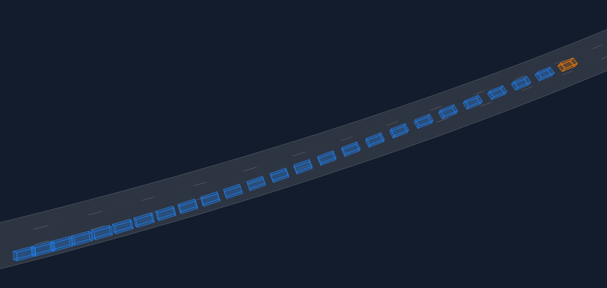
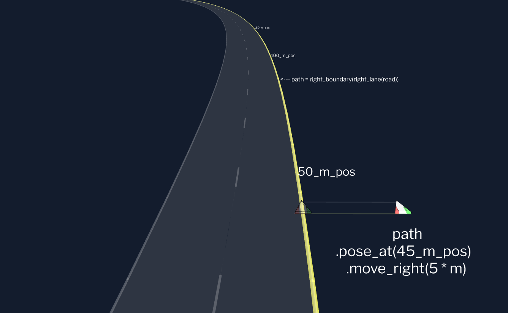
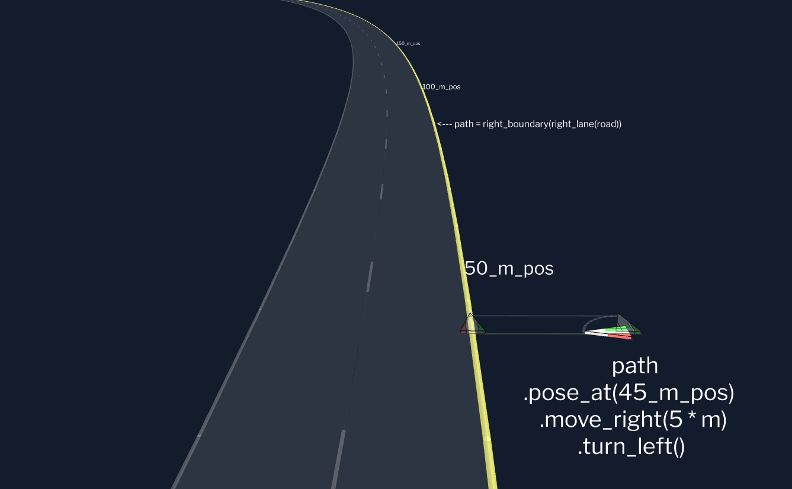
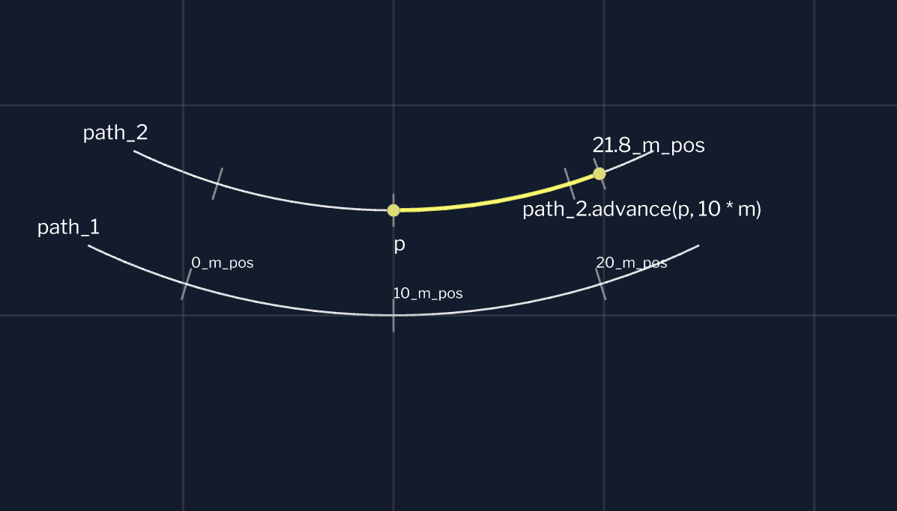
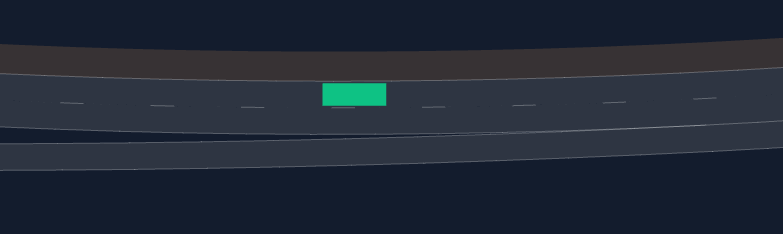
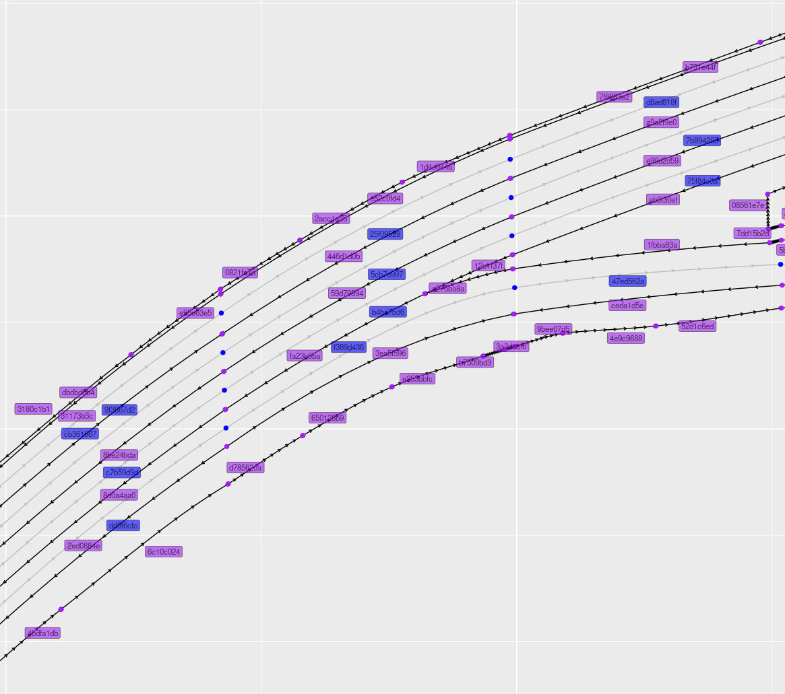
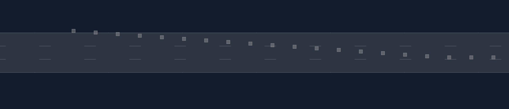
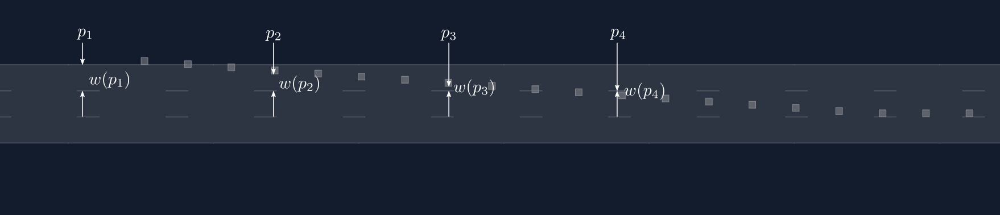
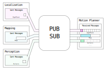

<section data-background="./Making Hard Tests Easy-_TitleCard copy.png" data-background-size="contain">

Notes:

- Welcome!
- Two kinds of audience
  - People testing functions w/complicated inputs
    - Testing is hard
    - use concrete example where we made it easy
    - Mention generic principles at the end
  - Motion planning for self driving
    - Lucky!  Clear, specific paths through design space

---

## Aurora and Me

<div class="r-stack">

<div class="fragment" style="position: absolute; width: 100%; text-align: center;">

</div>
</div>

Notes:

- Aurora
  - benefits of self driving, safely, quickly, broadly
  - launching first product _this year_: self-driving trucks, Dallas to Houston
- Me: Chip Hogg
  - Almost 4 years at Aurora, on motion planning team, almost 9 in self driving
  - Main contribution: making good tests easy

- Disclaimer
  - May not be exactly what you would find if you went to Aurora today
    - Interfaces evolve
    - Changed some terms
    - Some features are incomplete
  - The point of the talk is to communicate design principles

---

# Tests

Notes:

- Let's talk about tests generally.

---

## Testing Pyramid


Notes:

- Tests: on a spectrum
  - Unit: fine-grained, fast, isolated
  - Integration: bring components together
  - End-to-end: entire system
    - Self driving e2e examples: sim, track, on-road
  - Compiler errors: maybe even faster than unit tests
- Higher up: bigger scope, slower, more expensive
- Lower: isolated, fast, cheap, easy to understand, tight iteration cycles
- We're here in the middle: from big unit tests to integration tests

---

## Arrange, Act, Assert

```cpp
TEST(Florpinate, ProducesGoodStuff) {
  //
  // ARRANGE
  //
  // Create the inputs you'll need
  //
  const auto a = make_input_one();
  const auto b = make_input_two();

  //
  // ACT
  //
  // Perform the action under test
  //
  const auto result = florpinate(a, b);

  //
  // ASSERT
  //
  // Check the properties of what you made
  //
  EXPECT_THAT(result.stuff(), IsGood());
}
```

Notes:

- Unit/integration tests: 3 phases
  - Arrange: set things up
  - Act: the thing you're testing
  - Assert: did it do the right thing?
- Today's problem is in Arrange

---

## When inputs are complicated



Example: vehicle motion history

- Changing lanes
- Accelerating

Notes:

- Real world functions can have complicated inputs.
  - Example: Vehicle motion history
- Two bad choices
  - Realistic data (hard to set up / understand)
  - Simple fake data (doesn't test much)
- How to solve?
  - Tolstoy: "all simple function inputs are alike; each complicated input is complicated in its own way"
  - Pick _one_ complicated input, study, and generalize

---

# Motion Planning<br>Crash Course

Notes:

- Learn just enough about Motion Planning to understand the example

---

## Autonomy stack

Notes:

- Black box: sensor data in, Gas/brake/steering commands out
- Repeat/re-plan multiple times per second
- Refine: well-defined components
  - Communicate via message passing, pub/sub
  - e.g., perception, control

---

## Motion Planner

Notes:

- Inputs:
  - Map (what's the world?)
  - Localization (where am I?)
  - Goal / Route (where am I going?)
  - Actors (who else is out there?)
- Output: trajectory
- Inner architecture
  - World builder
  - Plan generator
  - Plan chooser
  - Could have tests for any of these
- Cycle: the unit of integration test
  - Inputs: really complicated! (map, actors)
  - How to describe actor positions, in source code?
    - x/y/z/theta?  No, forces reader to make a grid
    - Relative to map?  No, map is for planner, not humans
  - In both cases: tons of boilerplate, obscures intent
  - Not even enough!  Need to describe history of motion

---

## First, make the (tests) easy


<div class="fragment">
<p>How to "make the (test) easy"?</p>
<ol>
  <li>Write imagined source code</li>
  <li>Think through implementation: feasibility, usability, scope, ...</li>
</ol>
</div>

Notes:

- Kent Beck: "Make the change easy (warning: this may be hard), then make the easy change"
  - Feels like a cheat code
  - Writing function, notice it needs another task: doing 2 problems in your head
    - Pause; put it aside
    - Now only one problem; write tests
    - Come back: now it's easy!
    - This is the way
- The "this may be hard" comes on a spectrum
  - Complicated function inputs tend to live on the harder side
- So: **how** to "make the change easy"?
  - 1. Figure out what "easy" would even look like
    - If you can't, no point in going further
    - Write source code, imagine you have everything you could want
  - 2. Look at what you wrote, judge the design
    - Feasibility: can you see your way to implementing?
    - Usability: easy to use correctly, hard to use incorrectly?
    - Scope: Doesn't have to do everything!  What are core use cases, peripheral, out-of-scope...

---

## What would "easy" look like?

<div class="r-stack">

<div style="width: 100%;">

```cpp
TEST_F(MotionPlanner, PlansLaneChangeAroundSlowVehicle) {
    const auto map = two_lane_straight_highway();  // Revisit this API...
    const auto lane = right_lane(only_road(map));

    const auto slow_car =
        car_sketcher({nominal_path(lane), 40_m_pos})
            .set_motion(50 * MPH)
            .sketch();

    const auto plan =
        SceneBuilder{
            {
                .map = map,
                .goal = final_pose(lane),
                .ego_path = {nominal_path(lane), 0_m_pos},
                .ego_motion = 65 * MPH,
            },
        }
        .add_track(slow_car)
        .run_cycle_through(RANKER);

    // Out of scope for this talk...
    EXPECT_THAT(plan, ChangesLaneTo(left_lane(only_road(map))));
}
```

</div>
<div class="fragment fade-in-then-out">
  <video style="width: 90%;">
    <source src="./figures/vis3d.webm" type="video/webm" style="width: 50%">
  </video>
</div>
<div class="fragment fade-in"></div>
</div>

Notes:

- What's an example motion planner test case?
  - 2 ln hwy, 65 in R ln, car doing 50 in front, nobody else
  - Want planner to propose a lane change
- All planner tests: based on **scene**
  - Key: describe the **map** (backdrop where scene takes place)
  - Make variable for lane of interest
- Slow car: use car "sketcher" (just enough detail, reasonable defaults)
- Now: build the scene
  - Constructor params: what you must supply every time
    - Map, goal, ego path and motion
  - Setters for everything else (add slow car)

Key points we can already see:

- **Map** is foundational
- **all** positions described relative to **physically meaningful paths**: no x/y/z/theta

Source code: high callsite readability
- Can picture scene... but just in case!
- Stretch goal: Interactive 3D vis

---

## Levels of solution

Notes:

- Level 1: paths, poses, motions
- Level 2: map abstraction
- Level 3: scene builder
- Level 0?  Any guesses?

---

## Level 0: units library!

<div class="r-stack">


</div>

Notes:

- Built for _these libraries_!
  - ...but brought in other stakeholders across Aurora
- CppCon 2021: shared what we learned
  - No better library available
- CppCon 2023: we open sourced it!
  - Personal opinion: _still_ the best C++14 or C++17 units library today!

---

# Level 1:<br>Poses, Paths, and Motions

---

## `Pose3D`

<div class="container">

<div class="r-stack">
<div class="fragment fade-in-then-out" data-fragment-index="1">

```cpp


Pose3D pose = get_starting_pose();


```

</div>

<div class="fragment fade-in-then-out" data-fragment-index="2">

```cpp


Pose3D pose = get_starting_pose()
    .move_forward(20 * m);


```

</div>

<div class="fragment fade-in-then-out" data-fragment-index="3">

```cpp


Pose3D pose = get_starting_pose()
    .move_forward(20 * m)
    .turn_right();


```

</div>

<div class="fragment fade-in-then-out" data-fragment-index="4">

```cpp
const auto curvature =
    BodyFrameCurvature{}
        .set_yaw_left_rate(0.05 * rad / m);

Pose3D pose = get_starting_pose()
    .move_forward(20 * m)
    .turn_right()
    .move_forward(20 * m, curvature);
```

</div>
</div>

<div class="pose">

<h4 class="fragment fade-in" data-fragment-index="1">Top:</h4>
<div class="r-stack">


</div>

<h4 class="fragment fade-in" data-fragment-index="1">Perspective:</h4>
<div class="r-stack">


</div>

</div>

</div>

Notes:

- "Pose" means "where": position plus orientation
  - Key capability: _chainable_ APIs to make _related_ poses

- Given starting pose, easy to make new one in readable way
  - ...where does that "starting pose" come from though?

---

## Poses come from paths

<div class="r-stack">




</div>

Notes:

- Ironclad rule: get **poses** from **meaningful paths in scene**
  - No x/y/z/theta.  Ever!
    - I will move the origin when you're not looking
    - Many bad tests will fail; all good tests will still pass
- Here's a path: right boundary of right lane of road
- Give it a position, get a pose, move it to where you want


old:
- Path object, `Ribbon`: map along-path position onto pose
  - `_m_pos` is our position type
  - "Ribbon", mathematically: a 3D path, with a surface orientation attached
  - "Road-optimized": more than just poses
  - Consider the following...

---

## Danger: curves ahead

<div class="r-stack">


</div>

Notes:

- For path like right boundary, also have left boundary
- Try to line them up: dilemma!
- Natural approach: positions get out of alignment (inside track is shorter)
- Can force-align: but then position differences aren't accurate distances!
- WDYT?  First approach?  Second?  Any strong opinions?

- Good news: real world has this problem too
  - Can use same solution: mile markers
  - Positions are just labels for points
  - Can't "add" two positions (like chrono `time_point`)
  - Subtracting _positions_ gives a _displacement_
    - still _approximately_ correct despite curvature
- Now we can appreciate our path type: `Ribbon`

---

## `Ribbon`: road-optimized path

<div class="r-stack">



</div>

Notes:

- Mathematically, "Ribbon" = 3D path + surface orientation
  - pose-at-each-position, where pose points along path, is equivalent
- `Ribbon` is "road-optimized".  What does that mean?
  - Translates between "position differences" and "real physical displacements"
  - Let's take a point `p`, at the 10 meter position.
  - Path can Advance by 10 meters
    - get 21.8 meter position (not just 20)
  - Measure along-path displacement, with "geodesic displacement", get just 8.5 meters

---

## Aside: hiding polymorphism

<div class="container">
<div>

```cpp
class RibbonImplementation {
 public:
  // Map: position -> pose
  virtual Pose3D pose_at(PositionD s) const = 0;

  // Advance by a physical distance.
  virtual PositionD advance(
    PositionD s, DisplacementD distance) const = 0;

  // Measure physical along-path distance.
  virtual DisplacementD geodesic_displacement(
    PositionD start, PositionD end) const = 0;
};
```

</div>
<div class="r-stack">
<div class="fragment fade-in" data-fragment-index="1">

```cpp
class Ribbon {


 private:
  std::shared_ptr<const RibbonImplementation> impl_;
};
```

</div>
<div class="fragment fade-in" data-fragment-index="2">

```cpp
class Ribbon {
 public:
    Pose3D pose_at(PositionD s) const {
      return impl_->pose_at(s);
    }

    PositionD advance(
        PositionD s, DisplacementD d) const {
      return impl_->advance(s, d);
    }

    DisplacementD geodesic_displacement(
        PositionD start, PositionD end) const {
      return impl_->geodesic_displacement(start, end);
    }

 private:
  std::shared_ptr<const RibbonImplementation> impl_;
};
```

</div>
</div>
</div>

<!--
<div class="fragment fade-in" data-fragment-index="3">

```cpp
Ribbon get_flat_ribbon_turning_left(CurvatureD k, Pose3D origin_pose) {
    // The origin pose is really arbitrary, as long as its orientation has no pitch or roll.
    return make_ribbon<ConstantLeftTurnRateRibbonFrom>(origin_pose, k);
}
```

</div>
-->

Notes:

- Ribbon is polymorphic
  - Implementation class w/ pure virtuals
  - End users don't see polymorphism!
- shared-ptr-to-const has **value semantics**, size of shared-ptr for any complexity
  - shared-ptr-to-non-const is hidden global variable :(
  - **lightweight value types**.
  - Immutable
  - pass all around program, can't get it wrong
- Implement API functions: delegate
- NOTE: the implementation also provides spatial derivatives such as curvature; not shown here

---

## `RelativePath`: interface type for actors

(Including us!)

<div class="container">
<div class="r-stack nolinenum">
<div class="fragment fade-out" data-fragment-index="1">

```cpp
class RelativePath {
 public:
  RelativePath(Ribbon path, PositionD current);


  Pose3D pose_at_ds(DisplacementD ds) const;

 private:
  std::shared_ptr<const RelativePathImpl> impl_;
};
```

</div>
<div class="fragment fade-in-then-out" data-fragment-index="1">

```cpp [3]
class RelativePath {
 public:
  RelativePath(Ribbon path, PositionD current);


  Pose3D pose_at_ds(DisplacementD ds) const;

 private:
  std::shared_ptr<const RelativePathImpl> impl_;
};
```

</div>
<div class="fragment fade-in-then-out" data-fragment-index="2">

```cpp [5-6]
class RelativePath {
 public:
  RelativePath(Ribbon path, PositionD current);

  explicit(false)
  RelativePath(Pose3D pose);


  Pose3D pose_at_ds(DisplacementD ds) const;

 private:
  std::shared_ptr<const RelativePathImpl> impl_;
};
```

</div>
<div class="fragment fade-in-then-out" data-fragment-index="3">

```cpp [8-10]
class RelativePath {
 public:
  RelativePath(Ribbon path, PositionD current);

  explicit(false)
  RelativePath(Pose3D pose);

  RelativePath(
    RelativePath path,
    DisplacementD new_zero);

  Pose3D pose_at_ds(DisplacementD ds) const;

 private:
  std::shared_ptr<const RelativePathImpl> impl_;
};
```

</div>
</div>
<div>
<div>

```cpp
// `RelativePath` is a great interface type!
void set_actor_path(RelativePath path);
```

</div>
<div class="r-stack nolinenum">
<div class="fragment fade-in-then-out" data-fragment-index="1">

```cpp
// Pass Ribbon-and-Position as a pair.
set_actor_path({nominal_path(lane), 40_m_pos});


```

</div>
<div class="fragment fade-in-then-out" data-fragment-index="2">

```cpp [4-9]
// Pass Ribbon-and-Position as a pair.
set_actor_path({nominal_path(lane), 40_m_pos});

// Pass a pose; get a straight path through the pose!
set_actor_path(
  right_boundary(lane)
    .pose_at(50_m_pos)
    .turn_left()
    .move_backwards(3_m));


```

</div>
<div class="fragment fade-in-then-out" data-fragment-index="3">

```cpp [11-12]
// Pass Ribbon-and-Position as a pair.
set_actor_path({nominal_path(lane), 40_m_pos});

// Pass a pose; get a straight path through the pose!
set_actor_path(
  right_boundary(lane)
    .pose_at(50_m_pos)
    .turn_left()
    .move_backwards(3_m));

// "Tare" the relative path at a new zero.
set_actor_path({ego_path, -50_m});
```

</div>
</div>
</div>
</div>

Notes:

- Can be nice to bundle ribbon and position
  - This gives us "relative path", a really handy interface type
  - Note how pose is indexed by **physical displacement**, not position labels:
    - "After moving a signed distance `ds`, where am I?"
  - Here's an example API that takes a `RelativePath`.
- Pass ribbon and position as braced pair
  - Easy to understand what is meant
- Pass a bare pose: implicitly converts to straight path through pose
- "Tare" the relative path at a new zero: move the path
  - Somebody following our path, and they're _currently_ 50 meters back

---

## `Motion`: speed profiles

$dt \rightarrow \left(ds, \frac{ds}{dt}, \frac{d^2s}{dt^2}\right)$

<div class="container">
<div class="r-stack nolinenum">
<div class="fragment fade-in-then-out" data-fragment-index="1">

```cpp
class Motion {
 public:
  explicit Motion(
    std::shared_ptr<const MotionImplementation> impl);


 private:
  std::shared_ptr<const MotionImplementation> impl_;
};
```

</div>
<div class="fragment fade-in" data-fragment-index="2">

```cpp [1,8,12]
class Motion {
 public:
  explicit Motion(
    std::shared_ptr<const MotionImplementation> impl);


  MotionSnapshot snapshot_at(DurationD dt) const;

 private:
  std::shared_ptr<const MotionImplementation> impl_;
};
```

</div>
<div class="fragment fade-in" data-fragment-index="3">

```cpp [6]
class Motion {
 public:
  explicit Motion(
    std::shared_ptr<const MotionImplementation> impl);

  Motion(VelocityD constant_speed);

  MotionSnapshot snapshot_at(DurationD dt) const;

 private:
  std::shared_ptr<const MotionImplementation> impl_;
};
```

</div>
</div>

<div class="r-stack nolinenum">
<div class="fragment fade-in-then-out" data-fragment-index="2">

```cpp
struct MotionSnapshot {
  DisplacementD displacement = ZERO;
  VelocityD velocity = ZERO;
  AccelerationD acceleration = ZERO;
};


```

</div>
<div class="fragment fade-in" data-fragment-index="3">

```cpp [6]
struct MotionSnapshot {
  DisplacementD displacement = ZERO;
  VelocityD velocity = ZERO;
  AccelerationD acceleration = ZERO;
};


```

</div>
</div>
</div>

Notes:

- `Motion` maps time onto along-path displacement and its derivatives
- Use same strategy: shared-ptr-to-const, value semantics, hide polymorphism
- Returns `MotionSnapshot`: along-path displacement, velocity, acceleration
- Implicitly constructible from speed
  - Covers 95% of use cases
  - Interface should take a motion; you can pass `20 * m / s`, `65 * MPH`, etc.
  - Later on, more complicated motions like braking:
    - Make builders.  Add functionality with no extra cost

---

## `RelativePath` and `Motion` compose

`Motion`: $\ \ \ dt \rightarrow \left(ds, \frac{ds}{dt}, \frac{d^2s}{dt^2}\right)$

`RelativePath`: $\ \ \ ds \rightarrow \left(\text{pose}, \text{curvature}\right)$

<div class="fragment fade-in">

```cpp
const auto [ds, v, a] = motion.snapshot_at(dt);
const auto [pose, curvature] = path.point_at_ds(ds);
```

</div>

Notes:

- (Explain mapping)
  - Note: we're using the fuller, curvature API here
- A scene described in terms of `Ribbon` and `Motion` is not static!
  - Can query at near-past and near-future times!
  - History; predictions
  - Motion is **self-consistent**:
    - You get a pose and velocity
    - Pose a short time later is what velocity would predict

---

# Level 2: Map Abstractions

Notes:

- A map is where you get paths that have meaning

---

## Two Basins in Design Space

<div class="container">
<div class="fragment fade-in" data-fragment-index="1">
<h3>Map Sketch</h3>
<div>

</div>
</div>

<div class="fragment fade-in" data-fragment-index="2">
<h3>Backdrops</h3>
<div class="r-stack">


</div>
</div>
</div>

Notes:

- Map Sketch: fully synthetic
- Backdrops: bundle nice paths on top of a real world map

---

## Map Sketch

<div class="container">

<div class="r-stack">
<div class="fragment fade-in-then-out" data-fragment-index="1">

```cpp
const auto road =
  RoadSketcher{}


    .finish_lane_and_road();
```

</div>
<div class="fragment fade-in-then-out" data-fragment-index="2">

```cpp
const auto road =
  RoadSketcher{}


    .finish_lane_and_start_another()


    .finish_lane_and_road();
```

</div>
<div class="fragment fade-in-then-out" data-fragment-index="3">

```cpp
const auto road =
  RoadSketcher{}


    .finish_lane_and_start_another()
    .finish_lane_and_start_another()


    .finish_lane_and_road();
```

</div>
<div class="fragment fade-in-then-out" data-fragment-index="4">

```cpp
const auto road =
  RoadSketcher{}
    .define_road_frame(flat_ribbon_turning_left)

    .finish_lane_and_start_another()
    .finish_lane_and_start_another()


    .finish_lane_and_road();
```

</div>
<div class="fragment fade-in-then-out" data-fragment-index="5">

```cpp
const auto road =
  RoadSketcher{}
    .define_road_frame(flat_ribbon_turning_left)
    .set_left_shoulder_width(4 * m)
    .finish_lane_and_start_another()
    .finish_lane_and_start_another()


    .finish_lane_and_road();
```

</div>
<div class="fragment fade-in-then-out" data-fragment-index="6">

```cpp
const auto road =
  RoadSketcher{}
    .define_road_frame(flat_ribbon_turning_left)
    .set_left_shoulder_width(4 * m)
    .finish_lane_and_start_another()
    .finish_lane_and_start_another(
      NO_LC_AVAILABILITY)

    .finish_lane_and_road();
```

</div>
<div class="fragment fade-in-then-out" data-fragment-index="7">

```cpp
const auto road =
  RoadSketcher{}
    .define_road_frame(flat_ribbon_turning_left)
    .set_left_shoulder_width(4 * m)
    .finish_lane_and_start_another()
    .finish_lane_and_start_another(
      begin_lc_availability(100_m_pos))

    .finish_lane_and_road();
```

</div>
<div class="fragment fade-in-then-out" data-fragment-index="8">

```cpp
const auto road =
  RoadSketcher{}
    .define_road_frame(flat_ribbon_turning_left)
    .set_left_shoulder_width(4 * m)
    .finish_lane_and_start_another()
    .finish_lane_and_start_another(
      begin_lc_availability(100_m_pos))
    .convert_to_onramp_at(50_m_pos)
    .finish_lane_and_road();
```

</div>
</div>

<div>
<div class="r-stack" style="width: 80%">


</div>
<div class="r-stack" style="width: 80%">



</div>
</div>

</div>

Notes:

- Road sketcher: readable synthetic roads
  - Number of lanes is number of times you say "finish lane"
- That's how you **make** it.  To **use** it...

---

## Two clients for sketches

<div class="container">
<div class="fragment fade-in" data-fragment-index="1">
<h3>Test Authors</h3>

- Known road
- APIs emphasize _callsite readability_
  - Use errors liberally<br>as nudges

<div class="r-stack nolinenum">
<div class="fragment fade-in-then-out" data-fragment-index="2">

```cpp
right_lane(road); // Or, instead:
only_lane(road);


```

</div>
<div class="fragment fade-in-then-out" data-fragment-index="3">

```cpp [4]
right_lane(road); // Or, instead:
only_lane(road);

left_neighbor(right_lane(road));


```

</div>
<div class="fragment fade-in-then-out" data-fragment-index="4">

```cpp [6,]
right_lane(road); // Or, instead:
only_lane(road);

left_neighbor(right_lane(road));

speed_limit(road);
```

</div>
<div class="fragment fade-in" data-fragment-index="5">

```cpp
right_lane(road); // Or, instead:
only_lane(road);

left_neighbor(right_lane(road));

speed_limit(road);
```

</div>
<div class="fragment fade-in" data-fragment-index="6">

```cpp [1-2]
right_lane(road); // Or, instead:
only_lane(road);

left_neighbor(right_lane(road));

speed_limit(road);
```

</div>
<div class="fragment fade-in" data-fragment-index="7">

```cpp [3]
right_lane(road); // Or, instead:
only_lane(road);

left_neighbor(right_lane(road));

speed_limit(road);
```

</div>
<div class="fragment fade-in" data-fragment-index="8">

```cpp [4]
right_lane(road); // Or, instead:
only_lane(road);

left_neighbor(right_lane(road));

speed_limit(road);
```

</div>
<div class="fragment fade-in" data-fragment-index="9">

```cpp [6]
right_lane(road); // Or, instead:
only_lane(road);

left_neighbor(right_lane(road));

speed_limit(road);
```

</div>
</div>

</div>

<div>


</div>

<div class="fragment fade-in" data-fragment-index="5">
<h3>Libraries</h3>

- Must handle _all possible roads_
- Iterate over lanes
- Partitioned into constant regions
- **"Clunky, yet precise"**

<div class="r-stack nolinenum">
<div class="fragment fade-in-then-out" data-fragment-index="6">

```cpp
for (const auto lane : road) {


}
```

</div>
<div class="fragment fade-in-then-out" data-fragment-index="7">

```cpp [2-9]
for (const auto lane : road) {
  auto positions =
    sample_positions(lane);

  for (const auto p : positions) {


  }
}
```

</div>
<div class="fragment fade-in-then-out" data-fragment-index="8">

```cpp [6]
for (const auto lane : road) {
  auto positions =
    sample_positions(lane);

  for (const auto p : positions) {
    left_neighbor_point_at(p, lane);


  }
}
```

</div>
<div class="fragment fade-in-then-out" data-fragment-index="9">

```cpp [8]
for (const auto lane : road) {
  auto positions =
    sample_positions(lane);

  for (const auto p : positions) {
    left_neighbor_point_at(p, lane);

    speed_limit_point_at(p, lane);
  }
}
```

</div>
</div>
</div>

</div>

Notes:

- Two clients, two sets of interfaces
- Test authors know their road
  - Pick a named feature you know is there
  - Error if it's not, _or if you chose a weird name_
- Test _libraries_ need to handle _all possible_ roads
  - These interfaces _iterate_ over lanes, _iterate_ over regions in a lane, etc.
- The tests you can make depend on what libraries you have on the right side...

---

## Tests that `RoadSketch` unlocks

<div class="r-stack">

<div class="fragment fade-in-then-out" data-fragment-index="2">
  <video style="width: 90%;">
    <source src="./figures/road-sketch-unlocks/streams.webm" type="video/webm" style="width: 50%">
  </video>
</div>


</div>

Notes:

- MP uses optimized rep for lanes/paths, called "streams"
  - Pretty easy to make streams from road sketch
  - Unlocks unit tests for many functions
    - Legit complicated inputs, made way easier!

- Holy grail integration test: "just run the planner"
  - Need to make a full AV map that is **consistent** with road sketch
    - Remember: it's not a road, just a high level description
  - No map maker, no planner tests
  - Feasible, but didn't do it b/c of _opportunity cost_

---

## Backdrops

<div class="r-stack">
<div class="container">
<div>

</div>

<div class="r-stack nolinenum">
<div class="fragment fade-in-then-out" data-fragment-index="1">

```cpp
class Hwy3LanesWExit {
 public:
  Hwy3LanesWExit();

  friend Lane left_lane(const Hwy3LanesWExit &h) {
    return h.left_;
  }

  friend Position split_point(const Hwy3LanesWExit&) {
    return 0_m_pos;
  }

  // ...

 private:
  AVMap map_;

  Lane left_;
  Lane center_;
  Lane right_;
  Lane exit;

  PositionD start_position_;
};
```

</div>
<div class="fragment fade-in-then-out" data-fragment-index="2">

```cpp
class Hwy3LanesWExit {
 public:
  Hwy3LanesWExit();

  friend Lane left_lane(const Hwy3LanesWExit &h) {
    return h.left_;
  }

  friend Position split_point(const Hwy3LanesWExit&) {
    return 0_m_pos;
  }

  // ...

 private:
  AVMap map_;

  Lane left_;
  Lane center_;
  Lane right_;
  Lane exit;

  PositionD start_position_;
};
```

</div>
<div class="fragment fade-in-then-out" data-fragment-index="3">

```cpp
Hwy3LanesWExit::Hwy3LanesWExit() :
  map_{fetch_map("hwy_3_lanes_w_exit"), "f7a4fff3"},
  left_{
    .map=map_,
    .path={"a43b8847", "cd3eede8", "07d85409"},
    .left_bound={"45493fb2", "1e963a78", "dff6e747"},
    .right_bound={"e45657dd", "e196e064", "7efc19fc"},
  },
  center_{
    .map=map_,
    .path={"9ba58c68", "7e04b76a", "25877bfd"},
    .left_bound={"18389e4c", "95ad65dd", "8d544a9b"},
    .right_bound={"66e3b528", "6280f64d", "ec46cb72"},
    .align_to=left_,
  },
  right_{ /* ... */ },
  exit_{ /* ... */ },
  start_position_{path_length({"a43b8847", "cd3eede8"})}
  {}
```

</div>
</div>
</div>

<div>

</div>
</div>

Notes:

- Backdrop: two jobs: hold real map; provide nice path objects
  - What _is_ it?
  - class with data members you'd expect
  - hidden friend functions
- To construct:
  - Look at topological graph from map
  - Find boundaries and paths
  - Align subsequent paths
  - Unit tests!
- Labor intensive, but gives full map

---

## Comparison

<table>
  <tr>
    <th></th>
    <th>Map Sketch</th>
    <th>Backdrops</th>
  </tr>
  <tr>
    <td>Using</td>
    <td class="good">Easy</td>
    <td class="good">Easy</td>
  </tr>
  <tr>
    <td>Making</td>
    <td class="good">Easy</td>
    <td class="poor">Very labor intensive</td>
  </tr>
  <tr>
    <td>Fidelity</td>
    <td class="fair">OK, but needs big investment</td>
    <td class="good">Perfect</td>
  </tr>
  <tr>
    <td>Startup cost</td>
    <td class="fair">Moderate (or high for full maps)</td>
    <td class="good">Low technical risk</td>
  </tr>
</table>


---

# Level 3: Scene Builder

Notes:

- Now we have:
  - _some_ solution for map data that gives meaningful paths
  - user-friendly poses, paths, and motions
- Time to enable writing real tests!
  - MP test cases: in terms of _scene_; so, **scene builder**

---

## Scene Builder: Interfaces (core)

<div class="r-stack nolinenum">
<div class="fragment fade-in-then-out" data-fragment-index="1" style="width: 100%;">

```cpp
TEST_F(MotionPlanner, CanRunInTest) {
  const auto road = HighwayMergeWithSubsequentExit{};

  const auto ego_position = merge_completion_position(road) - 300 * m;
  const auto cycle_result =
    SceneBuilder{
      {


      },
    }
      .run_cycle_through(RANKER);

  EXPECT_THAT(cycle_result, ProducesValidPlan());
}
```

</div>
<div class="fragment fade-in-then-out" data-fragment-index="2" style="width: 100%;">

```cpp [8]
TEST_F(MotionPlanner, CanRunInTest) {
  const auto road = HighwayMergeWithSubsequentExit{};

  const auto ego_position = merge_completion_position(road) - 300 * m;
  const auto cycle_result =
    SceneBuilder{
      {
        .map = road,


      },
    }
      .run_cycle_through(RANKER);

  EXPECT_THAT(cycle_result, ProducesValidPlan());
}
```

</div>
<div class="fragment fade-in-then-out" data-fragment-index="3" style="width: 100%;">

```cpp [9]
TEST_F(MotionPlanner, CanRunInTest) {
  const auto road = HighwayMergeWithSubsequentExit{};

  const auto ego_position = merge_completion_position(road) - 300 * m;
  const auto cycle_result =
    SceneBuilder{
      {
        .map = road,
        .goal = final_pose(right_lane(road)),


      },
    }
      .run_cycle_through(RANKER);

  EXPECT_THAT(cycle_result, ProducesValidPlan());
}
```

</div>
<div class="fragment fade-in-then-out" data-fragment-index="4" style="width: 100%;">

```cpp [10]
TEST_F(MotionPlanner, CanRunInTest) {
  const auto road = HighwayMergeWithSubsequentExit{};

  const auto ego_position = merge_completion_position(road) - 300 * m;
  const auto cycle_result =
    SceneBuilder{
      {
        .map = road,
        .goal = final_pose(right_lane(road)),
        .ego_path = {nominal_path(right_lane(road)), ego_position},

      },
    }
      .run_cycle_through(RANKER);

  EXPECT_THAT(cycle_result, ProducesValidPlan());
}
```

</div>
<div class="fragment fade-in" data-fragment-index="5" style="width: 100%;">

```cpp [11]
TEST_F(MotionPlanner, CanRunInTest) {
  const auto road = HighwayMergeWithSubsequentExit{};

  const auto ego_position = merge_completion_position(road) - 300 * m;
  const auto cycle_result =
    SceneBuilder{
      {
        .map = road,
        .goal = final_pose(right_lane(road)),
        .ego_path = {nominal_path(right_lane(road)), ego_position},
        .ego_motion = 65 * MPH,
      },
    }
      .run_cycle_through(RANKER);

  EXPECT_THAT(cycle_result, ProducesValidPlan());
}
```

</div>
<div class="fragment fade-in-then-out" data-fragment-index="6">
  <video style="width: 70%;">
    <source src="./figures/scene-builder-core/result.webm" type="video/webm">
  </video>
</div>
<div class="fragment fade-in" data-fragment-index="7" style="width: 100%;">

```cpp
TEST_F(MotionPlanner, CanRunInTest) {
  const auto road = HighwayMergeWithSubsequentExit{};

  const auto ego_position = merge_completion_position(road) - 300 * m;
  const auto cycle_result =
    SceneBuilder{
      {
        .map = road,
        .goal = final_pose(right_lane(road)),
        .ego_path = {nominal_path(right_lane(road)), ego_position},
        .ego_motion = 65 * MPH,
      },
    }
      .run_cycle_through(RANKER);

  EXPECT_THAT(cycle_result, ProducesValidPlan());
}
```

</div>
</div>

Notes:

- Describing scene: two kinds of inputs: constructor params, and chainable setters
  - Constructor: things you need every single time
  - Setters: more optional things
- Core data
  - Map
  - Goal
  - Ego path
  - Ego motion
- Can we picture this scene?
  - In the right lane
  - Merge finishes 300 m ahead
  - Exit after the merge
- Let's see
  - Distance rings show about 300 m back
  - Can see the merge, and the exit up ahead
- Readable test source code, says everything we care about, nothing we don't, backed up by vis

---

## Putting actors in the scene

<div class="container">
<div class="fragment fade-in" data-fragment-index="1">

#### Actor _Sketch_

<div class="r-stack nolinenum">
<div class="fragment fade-out" data-fragment-index="2">

```cpp
struct ActorSketchData {
  int64_t id;

  RelativePath path;
  Motion motion;

  ActorCategory category;
  Eigen::Vector3d extents_m;
};

```

</div>
<div class="fragment fade-in" data-fragment-index="2">

```cpp [3]
struct ActorSketchData {
  int64_t id;

  RelativePath path;
  Motion motion;

  ActorCategory category;
  Eigen::Vector3d extents_m;
};

```

</div>
</div>
<div class="r-stack nolinenum">
<div class="fragment fade-in" data-fragment-index="2">

```cpp
class ActorSketch {
 public:
  Pose3D ground_pose(DurationD dt = ZERO) const;
  DisplacementD length() const;
  // ...

  perception::Actor convert_to_actor();

 private:
  ActorSketchData data_;
};
```

</div>
<div class="fragment fade-in" data-fragment-index="3">

```cpp
class ActorSketch {
 public:
  Pose3D ground_pose(DurationD dt = ZERO) const;
  DisplacementD length() const;
  // ...

  perception::Actor convert_to_actor();

 private:
  ActorSketchData data_;
};
```

</div>
</div>
</div>
<div class="fragment fade-in" data-fragment-index="3">

#### Actor _Sketcher_

<div>

```cpp
class ActorSketcher {
 public:
  explicit ActorSketcher(RelativePath path);

  ActorSketcher &set_motion(Motion motion);
  ActorSketcher &set_category(ActorCategory category);
  ActorSketcher &set_length(DisplacementD length);
  // ...

  ActorSketch sketch();
};
```

</div>
<div class="fragment fade-in" data-fragment-index="4">

```cpp
ActorSketcher car_sketcher(RelativePath path) {
  return ActorSketcher{path}
    .set_category(ActorCategory::VEHICLE)
    .set_length(4.5 * m);
    .set_width(2.0 * m);
    .set_height(1.5 * m);
}

ActorSketcher truck_sketcher(RelativePath path);
ActorSketcher pedestrian_sketcher(RelativePath path);
```

</div>
</div>
</div>

Notes:

- We use _sketches_: high level descriptions of actors.
  - Data includes an ID, path-and-motion, actor type, and 3D extents
  - They're always boxes; still lets us write almost every desired test
- Can query properties, such as ground pose, length, etc.
  - Can convert to a "real" actor type
  - _Including a dynamically self-consistent sequence of historical observations_
    - Perception actor has this, _you get this for free_
- We make this with an **actor sketcher**.  Here's the generic version
  - Must supply path: defaults to stopped
  - Set the motion, type, etc. as desired
  - Call `.sketch()` when done
  - OK, but verbose
- Pre-configured actor sketchers show intent: car, truck, pedestrian, etc.
  - Prefer these

---

## Scene Builder: Adding actors

<div class="r-stack nolinenum">
<div class="fragment fade-in-then-out" data-fragment-index="1" style="width: 100%;">

```cpp


const auto cycle_result =
  SceneBuilder{
    {
      .map = road,
      .goal = final_pose(right_lane(road)),
      .ego_path = {nominal_path(right_lane(road)), ego_position},
      .ego_motion = 65 * MPH,
    },
  }


    .run_cycle_through(RANKER);
```

</div>
<div class="fragment fade-in-then-out" data-fragment-index="2" style="width: 100%;">

```cpp [1-3,21]
const auto car = car_sketcher({nominal_path(onramp(road)), ego_position})
  .set_motion(65 * MPH)
  .sketch()


const auto cycle_result =
  SceneBuilder{
    {
      .map = road,
      .goal = final_pose(right_lane(road)),
      .ego_path = {nominal_path(right_lane(road)), ego_position},
      .ego_motion = 65 * MPH,
    },
  }
    .add_actor(car)

    .run_cycle_through(RANKER);
```

</div>
<div class="fragment fade-in-then-out" data-fragment-index="3" style="width: 100%;">

```cpp [2]
const auto car = car_sketcher({nominal_path(onramp(road)), ego_position})
  .set_motion(accelerating_from(35 * MPH).to(75 * MPH).at(2 * m / s / s).currently(65 * MPH))
  .sketch()


const auto cycle_result =
  SceneBuilder{
    {
      .map = road,
      .goal = final_pose(right_lane(road)),
      .ego_path = {nominal_path(right_lane(road)), ego_position},
      .ego_motion = 65 * MPH,
    },
  }
    .add_actor(car)

    .run_cycle_through(RANKER);
```

</div>
<div class="fragment fade-in-then-out" data-fragment-index="4" style="width: 100%;">

```cpp [5-9,22]
const auto car = car_sketcher({nominal_path(onramp(road)), ego_position})
  .set_motion(accelerating_from(35 * MPH).to(75 * MPH).at(2 * m / s / s).currently(65 * MPH))
  .sketch()

const auto ped = pedestrian_sketcher({right_boundary(onramp(road))
                      .pose_at(ego_position + 40 * m)
                      .turn_left()
                      .move_backward(3 * m)})
            .sketch()


const auto cycle_result =
  SceneBuilder{
    {
      .map = road,
      .goal = final_pose(right_lane(road)),
      .ego_path = {nominal_path(right_lane(road)), ego_position},
      .ego_motion = 65 * MPH,
    },
  }
    .add_actor(car)
    .add_actor(ped)
    .run_cycle_through(RANKER);
```

</div>
<div class="fragment fade-in" data-fragment-index="5" style="width: 100%;">

```cpp
const auto car = car_sketcher({nominal_path(onramp(road)), ego_position})
  .set_motion(accelerating_from(35 * MPH).to(75 * MPH).at(2 * m / s / s).currently(65 * MPH))
  .sketch()

const auto ped = pedestrian_sketcher({right_boundary(onramp(road))
                      .pose_at(ego_position + 40 * m)
                      .turn_left()
                      .move_backward(3 * m)})
            .sketch()


const auto cycle_result =
  SceneBuilder{
    {
      .map = road,
      .goal = final_pose(right_lane(road)),
      .ego_path = {nominal_path(right_lane(road)), ego_position},
      .ego_motion = 65 * MPH,
    },
  }
    .add_actor(car)
    .add_actor(ped)
    .run_cycle_through(RANKER);
```

</div>


</div>

Notes:

- Now let's add some actors!
- Recall: here's our old scene
- Add a car on the on-ramp at our same position (same "mile marker"), doing 65
- Could use a more realistic scenario, getting up to speed
  - `accelerating_from`: a motion builder
    - Could you write it?  (Yeah!)
    - Didn't change our car sketcher, but when we wrote this motion builder, it got more powerful!
- Now add pedestrian facing the on ramp, 3 m away, stopped.
  - Thinking.
  - "Don't do it, pedestrian!  Bad idea!"
- _Can you picture this scene?_
- Here's the old scene: picture car and pedestrian... aaaand...
- Yes, there they are!
  - Apology: can only see positions
  - This is most important; we believe speed/facing are correct too

---

## Interlude: Visualization

<div class="container">
<div class="r-stack nolinenum">
<div class="fragment fade-out" data-fragment-index="2">

```cpp [15]
const auto road = HighwayMergeWithSubsequentExit{};

const auto p =
  merge_completion_position(road) - 300 * m;

const auto cycle_result =
  SceneBuilder{
    {
      .map = road,
      .goal = final_pose(right_lane(road)),
      .ego_path = {nominal_path(right_lane(road)), p},
      .ego_motion = 65 * MPH,
    },
  }
    .run_cycle_through(RANKER);


```

</div>
<div class="fragment fade-in" data-fragment-index="2">

```cpp [15-18]
const auto road = HighwayMergeWithSubsequentExit{};

const auto p =
  merge_completion_position(road) - 300 * m;

const auto cycle_result =
  SceneBuilder{
    {
      .map = road,
      .goal = final_pose(right_lane(road)),
      .ego_path = {nominal_path(right_lane(road)), p},
      .ego_motion = 65 * MPH,
    },
  }
    .run_cycle_through(
      RANKER,
      {.fail_and_visualize_to = "my_test"}
    );
```

</div>
</div>
<div class="r-stack nolinenum">
<div class="fragment fade-in" data-fragment-index="1">

```cpp
struct VisualizeTest {
    std::string fail_and_visualize_to = "";
};

```

</div>
</div>
</div>


Notes:

- Source code is as readable as possible... but it's not enough!
  - Must make it very easy to see the actual, built scene
  - Here's an example scene we built
- There's a second argument of _this_ type
- Use designated initializer: "fail and visualize to" "my test"
  - If nonempty, send data to S3 that a web tool can read
  - Interactive 3D visualizations!
    - That's where these screenshots come from
  - Why "fail"?  So we don't land test that tries-and-fails to send data to S3

---

# Intent-first APIs<br>and Evolution

Notes:

- All our APIs are very high level and intent based
- Obviously great for writing and reading
- Consider implications for **maintainability** as code evolves

---

## Construction and blockages

<div>
  
  <figcaption>

  By <a href="https://www.flickr.com/photos/oregondot/">OregonDOT</a> (Flickr), CC BY-SA 2.0 DEED, <https://www.flickr.com/photos/oregondot/35245496740/in/photostream/>

  </figcaption>
</div>

Notes:

- How to _describe_ a construction blockage?
  - Physically: bunch of barrels
  - **Logically:** a **boundary**
    - Hey, we have paths!
  - Strategy: describe the boundary
    - Pick a "main path" from the scene
    - Add checkpoints of _along-path positions_
    - Can add _lateral offsets_
  - Implementation: drop barrels whose edges fall along this path
    - If you block the left side, the barrels are **on** the left side

---

## Blockage example

<div class="container">
<div>

```cpp [5-11,26]
const auto road = TwoLaneStraightRoad{};

const auto ego_position = 0_m_pos;

const auto construction =
  block_left_side_along(
      right_boundary(left_lane(road)))
    .from(ego_position + 50 * m,
      MoveLeft{width(left_lane(road))})
    .through(ego_position + 100 * m)
    .to(ego_position + 250 * m);

const auto result =
  SceneBuilder{
    {
      .map = road,
      .goal = final_pose(left_lane(road)),
      .ego_path =
        {
          nominal_path(left_lane(road)),
          ego_position,
        },
      .ego_motion = 65 * MPH,
    },
  }
    .add_blockage(construction)
    .run_cycle_through(RANKER);
```

</div>

<div>
<div class="r-stack">


</div>
<div class="r-stack">


</div>
</div>
</div>

Notes:

- Example
  - We're in the left lane, two lane road, position zero
  - Block _left side_ along _right boundary_
  - Start 50 meters up, moved left by the lane width
  - Checkpoint at 100 meters, no lateral displacement
  - Ends at 250 meters
- What barrels did you picture?  Was it something like this?
- Here's the detected boundary
  - Note that tapering is very important

---

## Value of intent-first interfaces

<div class="fragment fade-in" data-fragment-index="1">

#### Categorical

</div>

<div class="r-stack">


</div>

<div class="fragment fade-in" data-fragment-index="2">

#### Continuous



</div>

Notes:

- We just saw a readable, flexible way to _place physical barrels_ in our scene, to describe construction.
- How does the planner _reason about construction?_
  - This is all about interfaces evolving over time!
- Consider a simple categorical implementation, maybe for a first pass
  - Divide into regions "unblocked", "partially blocked" (we can still fit), "fully blocked"
  - OK to get started
- Consider refined implementation:
  - Width as function of position
  - Much richer... but a big change

---

## Blockage test: categorical implementation

```cpp
const auto road = TwoLaneStraightRoad{};

const auto ego_lane = left_lane(road);
const auto ego_position = 0_m_pos;

const auto construction =
  block_left_side_along(right_boundary(ego_lane))
    .from(ego_position + 50 * m, MoveLeft{width(ego_lane)})
    .through(ego_position + 100 * m)
    .to(ego_position + 250 * m);

const auto selected_plan =
  SceneBuilder{
    {
      .map = road,
      .goal = final_pose(ego_lane),
      .ego_path = {nominal_path(ego_lane), ego_position},
      .ego_motion = 65 * MPH,
    },
  }
    .add_blockage(construction)
    .run_cycle_through(RANKER);

EXPECT_THAT(selected_plan, PlansLaneChange(Direction::RIGHT));
```

Notes:

- Here's source code for a test when the planner treats construction categorically

---

## Blockage test: continuous implementation

```cpp
const auto road = TwoLaneStraightRoad{};

const auto ego_lane = left_lane(road);
const auto ego_position = 0_m_pos;

const auto construction =
  block_left_side_along(right_boundary(ego_lane))
    .from(ego_position + 50 * m, MoveLeft{width(ego_lane)})
    .through(ego_position + 100 * m)
    .to(ego_position + 250 * m);

const auto selected_plan =
  SceneBuilder{
    {
      .map = road,
      .goal = final_pose(ego_lane),
      .ego_path = {nominal_path(ego_lane), ego_position},
      .ego_motion = 65 * MPH,
    },
  }
    .add_blockage(construction)
    .run_cycle_through(RANKER);

EXPECT_THAT(selected_plan, PlansLaneChange(Direction::RIGHT));
```

Notes:

- Here's that test's source code after the planner gets refactored to treat it _quantitatively_
- Can you spot the differences?
  - Two: slide title, and slide number
  - When you write tests in **intent based** way, using **physical features**:
    - Aaaalll those tests don't need to change when you refactor!

---

# Scene builder implementation strategy

Notes:

- Everything so far is "what will users write"
- But... how does this work?

---

## Building up `SceneDescription`

<div class="container">
<div>

```cpp
struct SceneDescription {
  MapData map;
  Goal goal;
  EgoState ego;
  std::vector<ActorSketch> actors;
  std::vector<BlockageSketch> blockages;

  PlannerConfig config;
};
```

<div class="fragment">

```cpp
struct Goal {
  Pose3D start_pose;
  DisplacementD length;
  GoalType type;
};
```

</div>
<div class="fragment">

```cpp
struct EgoState {
  RelativePath path;
  Motion motion;
  TurnSignalHistory turn_signal;
};
```

</div>

</div>

<div>

```cpp
class SceneBuilder {
 public:
  // ...

 private:
  SceneDescription scene_;
};
```

<div class="fragment">

```cpp
SceneBuilder &SceneBuilder::add_actor(
    ActorSketch sketch) {
  scene_.actors.push_back(sketch);
  return *this;
}
```

</div>

</div>
</div>

Notes:

- SceneBuilder functions build up a "scene description"
  - Just a struct to collect hi-level descriptions
- We can imagine what some of these are
  - goal
  - ego state
- Fluent API implementations really simple
  - add actor
- That's not super interesting.  What's _really_ interesting is what you _do_ with `SceneDescription`

---

## Planner is based on messages

<div class="r-stack">
<div class="r-stack planner_messages">




</div>

<div class="container planner_msgs_code">
<div class="r-stack nolinenum">
<div class="fragment fade-in-then-out" data-fragment-index="5">

```cpp
struct SceneDescription {
  MapData map;
  Goal goal;
  EgoState ego;
  std::vector<ActorSketch> actors;
  std::vector<BlockageSketch> blockages;

  PlannerConfig config;
};
```

```cpp
struct Goal {
  Pose3D start_pose;
  DisplacementD length;
  GoalType type;
};
```

```cpp
struct EgoState {
  RelativePath path;
  Motion motion;
  TurnSignalHistory turn_signal;
};
```

</div>
<div class="fragment fade-in-then-out" data-fragment-index="6">

```cpp [1,4,9]
struct SceneDescription {
  MapData map;
  Goal goal;
  EgoState ego;
  std::vector<ActorSketch> actors;
  std::vector<BlockageSketch> blockages;

  PlannerConfig config;
};
```

```cpp [1,5]
struct Goal {
  Pose3D start_pose;
  DisplacementD length;
  GoalType type;
};
```

```cpp [1,2,3,5]
struct EgoState {
  RelativePath path;
  Motion motion;
  TurnSignalHistory turn_signal;
};
```

</div>
<div class="fragment fade-in-then-out" data-fragment-index="7">

```cpp [1,2,9]
struct SceneDescription {
  MapData map;
  Goal goal;
  EgoState ego;
  std::vector<ActorSketch> actors;
  std::vector<BlockageSketch> blockages;

  PlannerConfig config;
};
```

```cpp [1,5]
struct Goal {
  Pose3D start_pose;
  DisplacementD length;
  GoalType type;
};
```

```cpp [1,5]
struct EgoState {
  RelativePath path;
  Motion motion;
  TurnSignalHistory turn_signal;
};
```

</div>
<div class="fragment fade-in-then-out" data-fragment-index="8">

```cpp [1,5,6,9]
struct SceneDescription {
  MapData map;
  Goal goal;
  EgoState ego;
  std::vector<ActorSketch> actors;
  std::vector<BlockageSketch> blockages;

  PlannerConfig config;
};
```

```cpp [1,5]
struct Goal {
  Pose3D start_pose;
  DisplacementD length;
  GoalType type;
};
```

```cpp [1,5]
struct EgoState {
  RelativePath path;
  Motion motion;
  TurnSignalHistory turn_signal;
};
```

</div>

</div>

<div><!-- Empty second column --></div>
</div>
</div>

Notes:

- Recall: planner gets input messages (map, route, actors, ...)
- Implementation decomposes perfectly:
  - For each input type, ask: what messages would I expect to see if I were in this situation?
  - Remember!  Can query scene at near-past times!
    - So for actors, it's easy to get whole _history_ of messages
      - Self-consistent!

---

## `SceneMessages`: a container of inputs

<div class="container">
<div>

#### Planner input types

```cpp
struct EgoPoseTopic {
  using MsgType = localization::proto::Pose;
};
constexpr auto EGO_POSE = EgoPoseTopic{};


struct MapTopic {
  using MsgType = mapping::proto::Map;
};
constexpr auto MAP = MapTopic{};


struct ActorsTopic {
  using MsgType = perception::proto::Actors;
};
constexpr auto ACTORS = ActorsTopic{};
```

</div>
</div>

Notes:

- Planner inputs represented by tag types
  - We have _canonical instances_ of these types, ready-made values
- For each input: a sequence of timestamped messages
- Can index into container with tag types
  - Takes care of awkwardness around saying, e.g., std-get-vector-timestamped-message-T
- Also more robust when actually running the planner
  - Can't "forget" to populate messages in a topic

---

## `InputSampler`: filling up `SceneMessages`

Notes:

- Two separate questions for each input type
  - What times should I see these messages?
  - What _contents_ should a message have, at a _given time_?
- This separation is key to testing extreme situations

---

## Input Tweaks

Notes:

- An "input tweak" combines a particular input, and some change
  - "drop all" means we never got any messages
  - "set latest age" shifts all timestamps, so we can simulate staleness
  - "mutate last" means do anything to the last message
- Key: **first** choose times, **then** generate message contents
  - e.g., "set latest age" for actors to 1 second (yikes!):
    - you get actor positions from _one second ago_, not current positions with a timestamp field tweaked
  - effortlessly consistent!
  - great for testing fault conditions

---

other stuffs

- problems, thinking ahead
  - ribbon: position -> pose.  Assumes self-consistency
    - Make generic "ribbon test harness", useful for unit tests of new ribbon implementations
  - actor history: assumes no collisions with each other or ego
    - Can imagine adding a collision check step
    - _Will not impact public interface!_
    - Don't need to add this in the MVP
  - dynamic feasibility
    - "path plus motion" is naive, just ask a controls engineer
    - Example: two lane road.  Can make a U-turn path --- but can a semi _drive it?_
    - Dynamic feasibility checks for _ego_ vehicle could explode the whole scheme!
    - Solution: trajectory fitter.  Path and motion are inputs... **and outputs**!
      - Throw exception if it changes too much, because test is badly written
      - **Does not change the public interface**
    - Takeaway:
      - **Not** that you need to do this right away
      - Just: make sure you're not coding yourself into a corner
